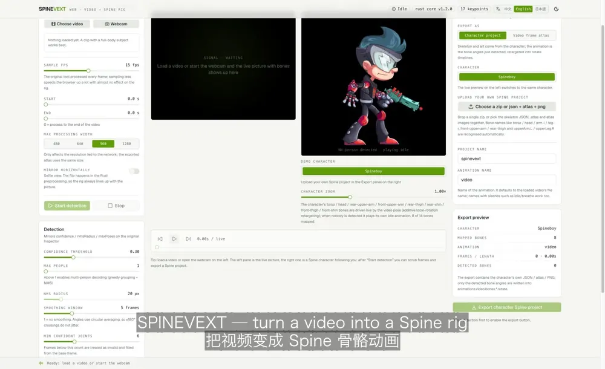

# SpineVExt · video → Spine skeletal animation

[中文](README.md) · **English** · [日本語](README.ja.md)

Turns a clip of a person (or your webcam) into a **skeletal animation project** you can open
directly in [Spine](https://esotericsoftware.com/): `<project>.json` + `<project>.atlas` + `<project>.png`.

**Inspired by [SpineVExt](https://jcupdev.itch.io/spinevext)** — the Unity desktop tool by jcupdev
(video → spine, running ResNet50 PoseNet on Unity + Barracuda). See
[“Where this comes from”](#where-this-comes-from-spinevext) below.

This is **not a port or a fork**: it is an independent rewrite that moves the whole pipeline to the
browser and the command line, with **every algorithmic core (decode, smooth, rig mapping, animation
baking, Spine export, atlas packing) written in Rust and bound three ways from one codebase**.

> Formulas, a point-by-point comparison with the original, and the pitfalls we hit live in
> [`docs/原理.md`](docs/原理.md) (Chinese).

## Where this comes from: SpineVExt

**The idea and the feature set come from [SpineVExt](https://jcupdev.itch.io/spinevext)** by jcupdev:

- Tool page: [jcupdev.itch.io/spinevext](https://jcupdev.itch.io/spinevext)
- v1.2 release notes: [Version 1.2 Release](https://jcupdev.itch.io/spinevext/devlog/667627/version-12-release)
  (v1.1: [Version 1.1 Release](https://jcupdev.itch.io/spinevext/devlog/664575/version-11-release))

The original is a Unity desktop tool: feed it a video or webcam, it runs ResNet50 PoseNet through
Barracuda, turns the keypoints into a Spine skeletal animation, and exposes Inspector knobs
(confidence / nmsRadius / maxPoses / GetBaseFrame / PropogateList). This repo deliberately keeps those
concepts in its UI and config so you can compare side by side (item-by-item notes in section 11 of
[`docs/原理.md`](docs/原理.md)).

How this repo relates to it:

- **an independent rewrite with none of the original code**: ~5k lines of Rust for the algorithm core,
  running in the browser (wasm-bindgen + onnxruntime-web) and on the command line (napi-rs / pure-Rust
  CLI + tract-onnx);
- **what is added**: a live dual view (picture + bones on the left, a Spine character following on the
  right), character-project export (retargeting the video motion onto your own rig), light/dark themes
  and a 中文 / English / 日本語 UI;
- the built-in **Spineboy** demo character comes from Spine’s official examples and follows the Spine
  Runtimes License; the original tool and its assets remain jcupdev’s.

## Demo video

[`docs/demo/spinevext-demo.mp4`](docs/demo/spinevext-demo.mp4) (2.7 MB / 1600×980 / 48 s, Chinese subtitles burned in)

What it shows: load a video → start detection (14 bones, base frame #32) → live picture + bones on the
left, a Spine character following on the right → switch characters → upload your own Spine project
(bone names are recognised automatically) → export a character project → light/dark theme → compare
with the video-frame atlas mode, ending on a real terminal run of the pure-Rust CLI.
Subtitles: [`docs/demo/spinevext-demo.srt`](docs/demo/spinevext-demo.srt) (`.ass` is the styled version used for burning).

### Quick guide (English UI, bilingual subtitles)



[`docs/demo/spinevext-guide-en.webp`](docs/demo/spinevext-guide-en.webp)
(1000×610 / 28.6 s / **0.6 MB**, animated WebP — renders right here on GitHub and in every browser)
walks through the English UI: pick a video → start detection → live follow → choose the export mode →
export. A GIF version of the same clip is
[`spinevext-guide-en.gif`](docs/demo/spinevext-guide-en.gif) (2.3 MB, for anything that does not
animate WebP). Chinese + English subtitles; the styled source is the `.ass` next to it.

## Three ways to run it

| Form          | Entry point                  | Binding              | Inference runtime      |
| ------------- | ---------------------------- | -------------------- | ---------------------- |
| Web app       | `vp dev` / `vp build`        | wasm-bindgen         | onnxruntime-web        |
| Node CLI      | `pnpm exec cli`              | napi-rs              | onnxruntime-node       |
| Pure Rust CLI | `cargo run -p spinevext-cli` | depends on the crate | tract-onnx (pure Rust) |

All three share `crates/spinevext-core` — nothing is implemented twice.

## Quick start

You need Node 20+, pnpm, and a Rust toolchain with the `wasm32-unknown-unknown` target.

```bash
pnpm install
pnpm exec vp run setup     # fetch the model + build WASM + build the napi native binding
pnpm exec vp dev           # open http://localhost:5183
```

In the UI: pick a video / webcam on the left → “Start detection” → scrub frames in the middle →
export a zip on the right.

### Commands

The project is on **Vite+** (the unified `vp` toolchain):

| Command                          | What it does                                              |
| -------------------------------- | --------------------------------------------------------- |
| `vp dev`                         | dev server (port 5183, permissive host / CORS)            |
| `vp build`                       | production build into `dist/`                             |
| `pnpm run serve`                 | serve `dist/` with correct MIME types and open CORS       |
| `vp test run`                    | Vitest (52 cases, including one that really runs a video) |
| `vp check`                       | format + type-aware lint + type check (0 errors)          |
| `vp run rust:test`               | Rust workspace tests (32 cases)                           |
| `vp run wasm`                    | build the WASM core                                       |
| `vp run native`                  | build the napi native binding                             |
| `vp run setup` / `vp run verify` | one-shot setup / full pre-delivery check                  |

`vp` is the Vite+ CLI (installed as the `vite-plus` dependency, run through `pnpm exec vp`).
Tasks live in `run.tasks` inside `vite.config.ts`, with dependencies and caching.

## Command line

### Pure Rust CLI (no Node needed)

```bash
cargo run -p spinevext-cli --release -- input.mp4 --out ./out \
  --fps 15 --max-width 960 --confidence 0.3 --smooth 5
```

It only needs the system `ffmpeg` / `ffprobe` (frame extraction) and Rust itself; inference runs on
pure-Rust `tract-onnx`. It writes `out/<project>.json` / `.atlas` / `.png` / `.zip`.

Measured on a MacBook, single-threaded CPU: a 2-second, 30-frame clip finishes in **1.0 s** with a
**212 MB peak RSS**.

Default policy: when the model has been pruned (only the convolutional backbone is left) tract’s
operator fusion is enabled — the same optimizer eats 20 GB+ and never finishes on the **original**
MoveNet graph, but takes 0.05 s once the graph is pruned, is ~5× faster, and produces bit-identical
frames (see section 10 of `docs/原理.md`). Override with `--no-optimize` / `--optimize`.

### Node CLI

```bash
pnpm install
pnpm exec cli input.mp4 --out ./out --fps 15
```

Runs the full MoveNet model on `onnxruntime-node`; everything else goes through the same Rust core.

## Pipeline

1. Frames: `<video>` / ffmpeg → RGBA;
2. Preprocess (Rust): letterbox (NHWC) or cover-crop (NCHW) depending on the model family;
3. Inference: MoveNet / PoseNet family ONNX, output layout detected automatically;
4. Decode (Rust): heatmap argmax + offsets + confidence + multi-person NMS;
5. Smooth (Rust): confidence weighting + circular angle averaging;
6. Rig (Rust): 17 keypoints → local rotations of 14 bones;
7. Bake (Rust): base-frame selection, propagation of missing bones;
8. Export (Rust): Spine 4.3 JSON (format version pinned to `4.3.23`) + `.atlas` + atlas PNG (+ zip);
9. **Live dual view**: video/webcam + bones on the left (真·real-time refresh), a Spine character following on the right;
10. Preview: the official `@esotericsoftware/spine-webgl` runtime plays the exported project right in the page (pause, speed, zoom).

There are two export paths (see “Export: character project / video frame atlas” below): bake the
detection onto the character’s bones, or pack the video frames themselves into an atlas.

The UI supports a **light / dark theme** (top-right toggle, stored in localStorage).

### UI languages (i18n)

The header switches between **中文 / English / 日本語**, stored in localStorage; without a stored
choice it follows the browser language (`zh*` → Chinese, `ja*` → Japanese, otherwise English) and
updates `<html lang>`.

All strings live in one table: [`src/i18n/dictionary.ts`](src/i18n/dictionary.ts) — dotted keys that
map one-to-one to the source files. Adding a language means adding a code to `LANGUAGES` and one
column per key; `tests/i18n.test.ts` checks that **every language has every key and the same `{name}`
placeholders**, and scans the components for hard-coded CJK text (comments aside).

Status-bar messages store a key plus parameters instead of a translated string, so **switching
language retranslates messages that are already on screen**.

### Demo characters (live pose retargeting)

One demo character ships on the right of the stage; video and webcam both drive it live:

| Character       | Source                                                   |
| --------------- | -------------------------------------------------------- |
| Spineboy        | the official Spine sample `examples/spineboy` (8 bones)  |
| Your own upload | “Choose a zip or json + atlas + png” in the Export panel |

Retargeting is “additive local rotation”: `characterBone.rotation = restAngle + (currentLocal − baseLocal)`,
so no bone lengths or bind poses have to be calibrated; when nobody is detected the character plays
its own idle animation.

Uploaded projects have their bone names guessed automatically: `torso / head / arm-l / leg-r`,
`front-upper-arm / rear-thigh` and `upperArm.L / upperLeg.R` all work (`guessRig`), and it fails
loudly when nothing can be mapped. To add a built-in character, drop it into
`public/demo/<name>/` (JSON + atlas + PNG) and add an entry to `DEMO_CHARACTERS` in
`src/core/character.ts`.

### Export: character project / video frame atlas

“Export as” in the right-hand panel decides what you get; both are Spine 4.3 projects
(JSON + atlas + PNG + zip). Both declare the **same pinned format version `4.3.23`**
(`spine::SPINE_VERSION` in Rust is the single source of truth; the character export reads the very
same value through `engine.spineVersion`).

| Mode              | Skeleton & art                         | Animation data                                 | Good for                                  |
| ----------------- | -------------------------------------- | ---------------------------------------------- | ----------------------------------------- |
| Character project | the character’s own                    | **the bone angles just detected** (retargeted) | character art animated by a real person   |
| Video frame atlas | the video picture, one image per frame | attachment swaps only, no bone rotation        | frame-by-frame preservation of the source |

In character mode the exported `<project>.json` contains
`animations.<animation>.bones.<characterBone>.rotate`, whose values are
`character rest angle + clamp(that frame’s local angle − base frame local angle, ±60°)`; the atlas
and images come entirely from the character, with no video frames mixed in.

The exported project **opens straight in the Spine editor** — the export normalises three things
(`normalizeCharacterProject`, see section 8.7 of [`docs/原理.md`](docs/原理.md)):

- it drops `skeleton.images` (the editor prepends that directory to the page name, so
  `images: "./images/"` plus a page named `images/tail-fin.png` ends up looking for
  `images/images/tail-fin.png` and the whole character shows up as `MISSING`) and flattens the page
  images into the project root;
- non-ASCII part names become English ones (using the file name of the page the region lives on:
  `脸→face`, `左臂→arm-l`, `后发→hair-back`, …), and slot names / attachment names / animation
  references are renamed together;
- every page block is guaranteed a blank line in front — Spine’s `TextureAtlas` only starts a new
  page after an empty line, so a source atlas that omits them (or sprinkles them between regions)
  would otherwise be parsed wrongly;
- already-English projects (the official Spineboy) keep their names and only get flattened paths.

A regression test loads the exported project with the **official runtime** (a missing region throws
`Region not found in atlas` on the spot) using the real assets — see `tests/character-project.test.ts`.
Old exports can be repaired with
`node_modules/.bin/jiti scripts/normalize-export.ts <old dir> <new dir>`.

The end-to-end check lives in `tests/character-export.integration.test.ts`: it really runs
`.test-assets/person-rot.mp4` through the pure-Rust CLI, bakes the detected bones onto Spineboy, and
asserts that the zip contains nothing but the character’s own JSON / atlas / PNG.

## Layout

```
crates/spinevext-core/   algorithm core (no wasm / node deps, unit-testable on its own)
crates/spinevext-node/   napi-rs binding (for Node)
crates/spinevext-cli/    pure Rust CLI (tract-onnx inference + ffmpeg frame extraction)
src/core/                TypeScript orchestration: engine wrapper, inference, frames, pipeline, export
src/i18n/                UI strings (zh-CN / en / ja) and the tiny i18n store
src/components/          UI (shadcn/ui + Tailwind v4)
src/wasm/pkg/            wasm-pack output (generated, git-ignored)
native/                  napi output (generated; the produced index.d.ts is kept)
public/models/           pose model
docs/原理.md              algorithm notes (Chinese)
```

## Known limitations

- MoveNet is single-person: in a crowd only the most confident person comes out. Swap in a PoseNet
  (heatmap + offset) ONNX for multi-person — the core already supports multi-person decoding and NMS.
- ONNX Runtime runs as single-threaded WASM in the browser (to avoid COOP/COEP requirements); lower
  the sample fps for long clips.
- The exported atlas is uncompressed RGBA; for many frames or high resolutions, reduce “Atlas scale”.
- Diagnostic errors thrown by the Rust core stay in Chinese; only UI strings are translated.
