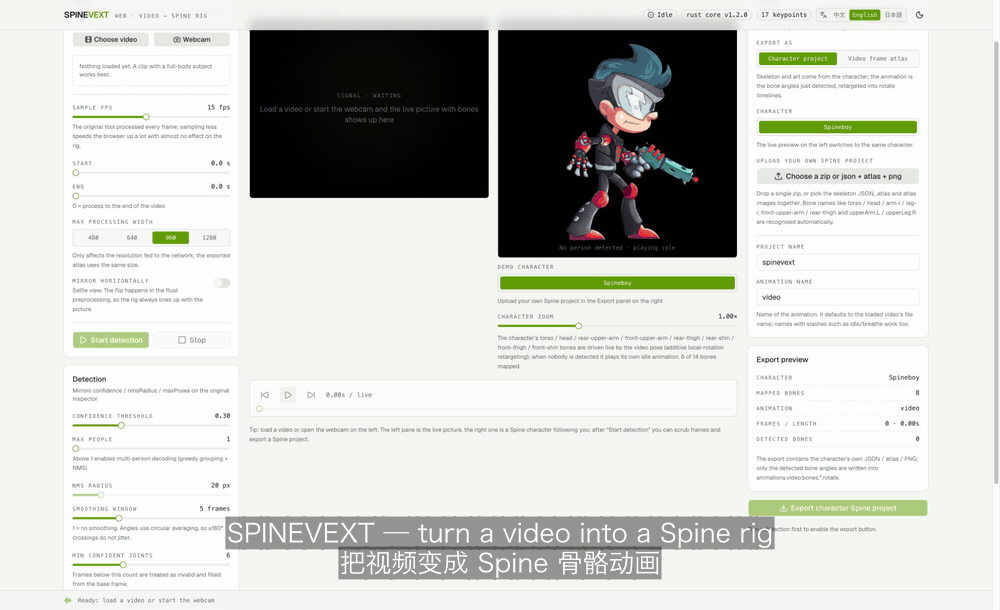

# SpineVExt · 動画から Spine ボーンアニメーションへ

[中文](README.md) · [English](README.en.md) · **日本語**

人物の動画（またはカメラ映像）を、[Spine](https://esotericsoftware.com/) でそのまま開ける
**ボーンアニメーションプロジェクト**に変換します：`<プロジェクト名>.json` + `<プロジェクト名>.atlas` + `<プロジェクト名>.png`。

**インスピレーション元は [SpineVExt](https://jcupdev.itch.io/spinevext)** —— jcupdev 氏の
Unity 製デスクトップツール（video → spine、Unity + Barracuda で ResNet50 PoseNet）。
詳しくは下の[「出典」](#出典-spinevext)へ。

本リポジトリは移植でもフォークでもなく**独立した書き直し**です。パイプライン全体をブラウザと
コマンドラインへ移し、**アルゴリズムの中核（デコード・平滑化・ボーンマッピング・アニメ書き込み・
Spine 書き出し・アトラス詰め込み）をすべて Rust で書き、1 つのコードを 3 通りにバインド**しています。

> 数式・オリジナルとの項目ごとの比較・踏んだ落とし穴は [`docs/原理.md`](docs/原理.md)（中国語）に。

## 出典: SpineVExt

**アイデアと機能の目標は [SpineVExt](https://jcupdev.itch.io/spinevext)（作者 jcupdev）から**：

- ツールページ: [jcupdev.itch.io/spinevext](https://jcupdev.itch.io/spinevext)
- v1.2 リリースノート: [Version 1.2 Release](https://jcupdev.itch.io/spinevext/devlog/667627/version-12-release)
  （v1.1: [Version 1.1 Release](https://jcupdev.itch.io/spinevext/devlog/664575/version-11-release)）

オリジナルは Unity 製のデスクトップツールで、動画やカメラ映像を入力に Barracuda で
ResNet50 PoseNet を走らせ、キーポイントを Spine のボーンアニメーションへ変換します。
Inspector には confidence / nmsRadius / maxPoses / GetBaseFrame / PropogateList といった
パラメータがあります。本リポジトリはその考え方を UI と設定に残しており、見比べられます
（項目ごとの対比は [`docs/原理.md`](docs/原理.md) 第 11 節）。

関係性:

- **原版のコードは含まない独立実装**：アルゴリズム中核は約 5 千行の Rust。
  ブラウザ（wasm-bindgen + onnxruntime-web）とコマンドライン（napi-rs / 純 Rust CLI + tract-onnx）
  の両方で動きます；
- **追加したもの**：リアルタイム 2 画面（左は映像＋ボーン、右は Spine キャラが追従）、
  キャラクタープロジェクト書き出し（動画の動きを自分のリグへリターゲット）、
  ライト／ダークテーマ、中文 / English / 日本語 UI；
- 内蔵デモキャラ **Spineboy** は Spine 公式サンプル由来（Spine Runtimes License）。
  原版ツールとその素材の権利は jcupdev 氏に帰属します。

## デモ動画

[`docs/demo/spinevext-demo.mp4`](docs/demo/spinevext-demo.mp4)（2.7 MB / 1600×980 / 48 秒、中国語字幕を焼き込み）

内容：動画を読み込む → 検出開始（14 ボーン・基準フレーム #32）→ 左は映像＋ボーン、右は Spine キャラが追従
→ キャラ切替 → 自分の Spine プロジェクトを読み込む（ボーン名は自動認識）→ キャラプロジェクトを書き出し
→ ライト／ダークテーマ → フレームアトラスとの比較、最後に純 Rust CLI のターミナル実録。
字幕は [`docs/demo/spinevext-demo.srt`](docs/demo/spinevext-demo.srt)（`.ass` は焼き込み用のスタイル版）。

### 使い方の早見（英語 UI・中英二言語字幕）



`docs/demo/spinevext-guide-en.gif`（1000×610 / 28 秒 / 2.3 MB）：英語 UI で
動画を選ぶ → 検出開始 → リアルタイム追従 → 書き出しモードの選択 → 書き出し、までを一通り。
字幕は中国語＋英語、スタイル付きの元ファイルは同じディレクトリの `.ass` です。

## 3 つの実行形態

| 形態        | 入口                         | バインディング   | 推論ランタイム        |
| ----------- | ---------------------------- | ---------------- | --------------------- |
| Web アプリ  | `vp dev` / `vp build`        | wasm-bindgen     | onnxruntime-web       |
| Node CLI    | `pnpm exec cli`              | napi-rs          | onnxruntime-node      |
| 純 Rust CLI | `cargo run -p spinevext-cli` | crate を直接依存 | tract-onnx（純 Rust） |

3 つとも `crates/spinevext-core` を共有しており、二重実装はありません。

## クイックスタート

Node 20+、pnpm、`wasm32-unknown-unknown` ターゲットを含む Rust ツールチェーンが必要です。

```bash
pnpm install
pnpm exec vp run setup     # モデル取得 + WASM ビルド + napi ネイティブビルド
pnpm exec vp dev           # http://localhost:5183 を開く
```

画面では：左で動画／カメラを選ぶ →「検出を開始」→ 中央でフレームを確認 → 右で zip を書き出す。

### コマンド

本プロジェクトは **Vite+**（統一ツールチェーン `vp`）に移行済みです。

| コマンド                         | 内容                                                |
| -------------------------------- | --------------------------------------------------- |
| `vp dev`                         | 開発サーバ（5183、host / CORS は開放）              |
| `vp build`                       | `dist/` へ本番ビルド                                |
| `pnpm run serve`                 | 正しい MIME と緩い CORS で `dist/` を配信           |
| `vp test run`                    | Vitest（52 ケース、実際に動画を回す統合テスト込み） |
| `vp check`                       | フォーマット + 型認識 lint + 型チェック（error 0）  |
| `vp run rust:test`               | Rust ワークスペースのテスト（32 ケース）            |
| `vp run wasm`                    | WASM コアをビルド                                   |
| `vp run native`                  | napi ネイティブバインディングをビルド               |
| `vp run setup` / `vp run verify` | 初回準備 / 納品前の総合チェック                     |

`vp` は Vite+ の CLI です（`vite-plus` 依存として入っており、`pnpm exec vp` で実行）。
タスク定義は `vite.config.ts` の `run.tasks` にあり、依存関係とキャッシュが付いています。

## コマンドライン

### 純 Rust CLI（Node 不要）

```bash
cargo run -p spinevext-cli --release -- input.mp4 --out ./out \
  --fps 15 --max-width 960 --confidence 0.3 --smooth 5
```

必要なのは OS の `ffmpeg` / `ffprobe`（フレーム抽出）と Rust だけ。推論は純 Rust の
`tract-onnx` で行います。`out/<名前>.json` / `.atlas` / `.png` / `.zip` を出力します。

実測（MacBook・シングルスレッド CPU）：2 秒 30 フレームの動画が **1.0 秒**、**メモリピーク 212MB**。

既定の方針：モデルが剪定済み（畳み込みバックボーンだけ）なら tract の演算子融合を有効にします。
同じ最適化器は**元の** MoveNet グラフでは 20GB 以上を消費して完走しませんが、剪定後は 0.05 秒、
推論は約 5 倍速く、結果はフレーム単位で完全に同一です（`docs/原理.md` 第 10 節）。
必要なら `--no-optimize` / `--optimize` で上書きできます。

### Node CLI

```bash
pnpm install
pnpm exec cli input.mp4 --out ./out --fps 15
```

`onnxruntime-node` で完全な MoveNet を動かし、それ以外は同じ Rust コアに任せます。

## パイプライン

1. フレーム取得：`<video>` / ffmpeg → RGBA；
2. 前処理（Rust）：モデル系統に応じて letterbox(NHWC) か cover クロップ(NCHW)；
3. 推論：MoveNet / PoseNet 系 ONNX、出力レイアウトは自動判定；
4. デコード（Rust）：heatmap argmax + offsets + 信頼度 + 複数人 NMS；
5. 平滑化（Rust）：信頼度重み付き + 円周角度平均；
6. ボーン（Rust）：17 キーポイント → 14 ボーンのローカル回転；
7. 書き込み（Rust）：基準フレーム選定、欠損ボーンの伝播；
8. 書き出し（Rust）：Spine 4.3 JSON（形式バージョンは `4.3.23` に固定）+ `.atlas` + アトラス PNG（+ zip）；
9. **リアルタイム 2 画面**：左は映像／カメラ＋ボーン（真のリアルタイム更新）、右は Spine キャラが追従；
10. プレビュー：公式 `@esotericsoftware/spine-webgl` ランタイムが書き出したプロジェクトをその場で再生（一時停止・速度・拡大）。

書き出しは 2 通り（下の「書き出し：キャラクター／フレームアトラス」参照）：検出結果をキャラの
ボーンに焼き込むか、動画フレームそのものをアトラスに詰めるかです。

UI は**ライト／ダークテーマ**に対応（右上で切替、選択は localStorage に保存）。

### 表示言語（i18n）

ヘッダーで **中文 / English / 日本語** を切り替えられ、選択は localStorage に保存されます。
未保存ならブラウザ言語に従います（`zh*` → 中国語、`ja*` → 日本語、その他 → English）。
`<html lang>` も更新します。

文言は 1 つの表 [`src/i18n/dictionary.ts`](src/i18n/dictionary.ts) にまとまっており、
key はドット区切りでソースファイルと 1 対 1 に対応します。言語を足すときは `LANGUAGES` に
コードを追加し、各 key に列を足すだけ。`tests/i18n.test.ts` が**全言語で key が揃っているか、
`{name}` プレースホルダが一致しているか**を検証し、さらにコンポーネント内のハードコードされた
中国語（コメントを除く）を検出します。

ステータスバーのメッセージは翻訳済み文字列ではなく key + パラメータで保持するため、
**言語を切り替えると表示中のメッセージも即座に翻訳し直されます**。

### デモキャラ（姿勢のリアルタイムリターゲット）

ステージ右側にデモキャラを 1 体内蔵し、動画でもカメラでもリアルタイムに動かせます：

| キャラ             | 出典                                                     |
| ------------------ | -------------------------------------------------------- |
| Spineboy           | Spine 公式サンプル `examples/spineboy`（8 ボーン）       |
| 自分のプロジェクト | 「書き出し」パネルの「zip か json + atlas + png を選ぶ」 |

リターゲットは「加算的なローカル回転」：`キャラのボーン.rotation = 静止角 +（現在フレームのローカル角 − 基準フレームのローカル角）`。
ボーンの長さやバインド姿勢を測る必要はありません。人物が検出できないときは固有の待機モーションを再生します。

読み込んだプロジェクトはボーン名を自動推定します：`torso / head / arm-l / leg-r`、
`front-upper-arm / rear-thigh`、`upperArm.L / upperLeg.R` のいずれも `guessRig` が解釈し、
1 本も対応付けられないときは明確にエラーを出します。内蔵キャラを増やすには
`public/demo/<名前>/`（JSON + atlas + PNG）に置き、`src/core/character.ts` の
`DEMO_CHARACTERS` に 1 行足すだけです。

### 書き出し：キャラクター／フレームアトラス

右パネルの「書き出す内容」で決まります。どちらも Spine 4.3 プロジェクト（JSON + atlas + PNG + zip）で、
**形式バージョンは `4.3.23` に固定**です（Rust の `spine::SPINE_VERSION` が唯一の情報源で、
キャラクター書き出しも `engine.spineVersion` から同じ値を読みます）。

| モード           | 骨格と美術                  | アニメーションデータ                           | 向いている用途                   |
| ---------------- | --------------------------- | ---------------------------------------------- | -------------------------------- |
| キャラクター     | キャラ自身のもの            | **たった今検出したボーン角度**（リターゲット） | キャラの美術に実写の動きを載せる |
| フレームアトラス | 動画の絵（毎フレーム 1 枚） | アタッチメント差し替えのみ、ボーン回転なし     | 元の絵をフレーム単位で保つ       |

キャラクターモードで書き出す `<名前>.json` には
`animations.<アニメ名>.bones.<キャラのボーン>.rotate` が入り、値は
`キャラの静止角 + clamp(そのフレームのローカル角 − 基準フレームのローカル角, ±60°)`。
アトラスと画像は完全にキャラ由来で、動画フレームは混ざりません。

書き出したプロジェクトは**Spine エディタでそのまま開けます**。書き出し時に 3 つ正規化します
（`normalizeCharacterProject`、詳細は [`docs/原理.md`](docs/原理.md) 第 8.7 節）：

- `skeleton.images` を削除（エディタがこのディレクトリをページ名の前に連結するため、
  `images: "./images/"` と `images/tail-fin.png` の組み合わせは `images/images/tail-fin.png` を
  探してしまい、全身 `MISSING` になります）。ページ画像はプロジェクト直下に平坦化；
- 非 ASCII の部位名を英語名に変換（その region が載っているページのファイル名を使用：`脸→face`、
  `左臂→arm-l`、`后发→hair-back` など）。スロット名・アタッチメント名・アニメ内の参照もまとめて変更；
- 各ページブロックの直前に空行を必ず入れる — Spine の `TextureAtlas` は空行でしか新しいページを
  判定しないため、元ファイルに無い／region 間にあると誤解析されます；
- 元から英語のプロジェクト（公式 Spineboy）は名前をそのままに、パスだけ平坦化。

回帰テストは**公式ランタイム**で書き出したプロジェクトを読み込みます（region が見つからないと
`Region not found in atlas` をその場で投げます）。実素材で実行しており、`tests/character-project.test.ts` にあります。
古い書き出しは `node_modules/.bin/jiti scripts/normalize-export.ts <旧ディレクトリ> <新ディレクトリ>` で修復できます。

エンドツーエンドの検証は `tests/character-export.integration.test.ts`：純 Rust CLI で実際に
`.test-assets/person-rot.mp4` を回し、検出したボーンを Spineboy に焼き込み、zip の中身が
キャラ自身の JSON / atlas / PNG だけであることを検査します。

## ディレクトリ

```
crates/spinevext-core/   アルゴリズム中核（wasm / node 非依存、単体テスト可）
crates/spinevext-node/   napi-rs バインディング（Node 用）
crates/spinevext-cli/    純 Rust CLI（tract-onnx 推論 + ffmpeg フレーム抽出）
src/core/                TypeScript 側の編成：エンジンラッパ、推論、フレーム、パイプライン、書き出し
src/i18n/                UI 文言（zh-CN / en / ja）と最小の i18n ストア
src/components/          UI（shadcn/ui + Tailwind v4）
src/wasm/pkg/            wasm-pack 出力（生成物・git 管理外）
native/                  napi 出力（生成物・生成された index.d.ts は保持）
public/models/           姿勢モデル
docs/原理.md              アルゴリズム解説（中国語）
```

## 既知の制限

- MoveNet は単人モデル：複数人が映ると最も信頼度の高い 1 人だけを出力します。複数人には
  PoseNet（heatmap + offset）系 ONNX へ差し替えてください（コアは複数人デコードと NMS に対応済み）。
- ブラウザの ONNX Runtime はシングルスレッド WASM（COOP/COEP を避けるため）。長い動画は
  サンプル fps を下げてください。
- 書き出すアトラスは非圧縮 RGBA。フレーム数や解像度が大きいときは「アトラス倍率」を下げてください。
- Rust コアが投げる診断用エラーは中国語のままです（翻訳対象は UI 文言のみ）。
